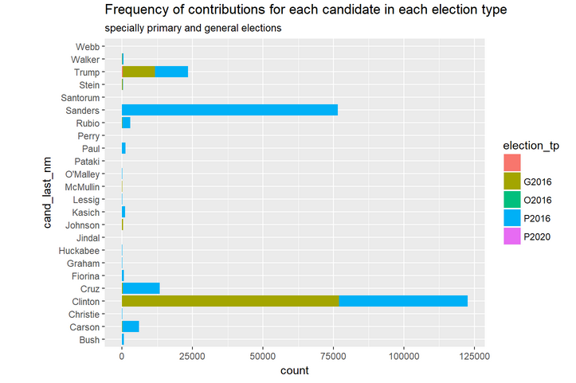
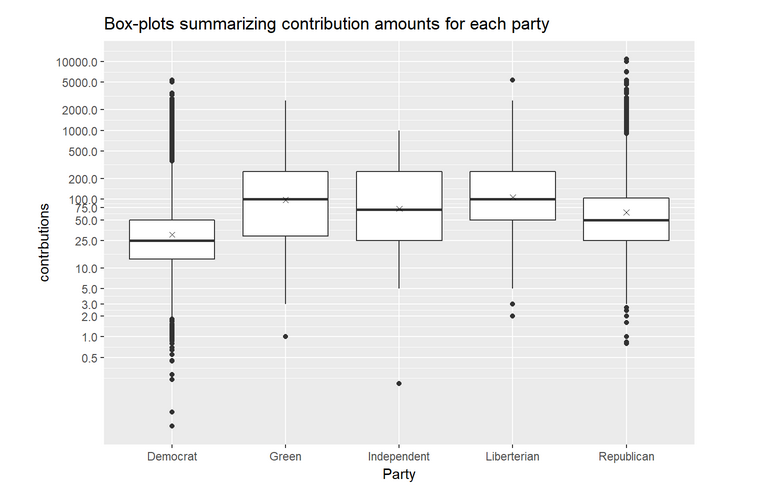
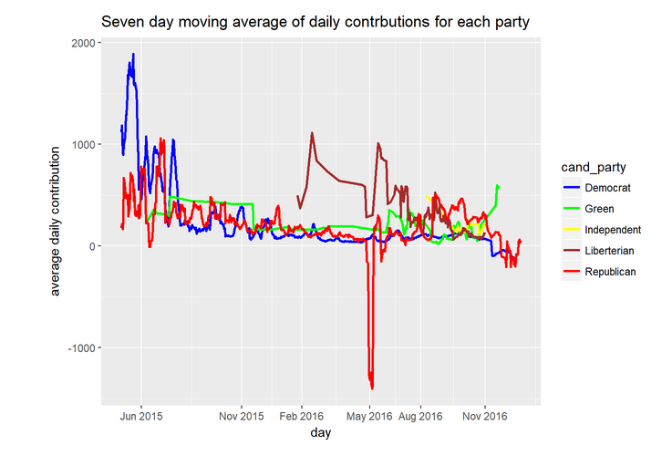
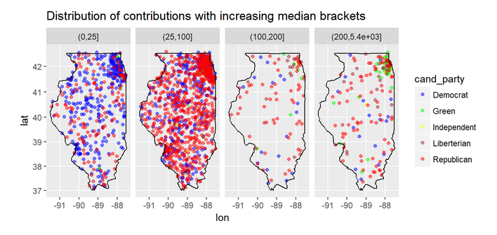

# Illinois 2016 election contributions.
## Exploratory analysis using RStudio

This is a project was completed in March 2018 as part of the Udacity Data Analyst nano degree program.

The project explores the 2016 election contributions by individuals. I compare contributions to front runners among the candidiates as well as parties. In addition, I compare contributions from cities, villeges, towns and some other locations in the state and outside it. 
Moreover, I look at the time series of conributions for each party. Finally, I consider the geographic distributions of contribution grouped by parties in four brackets.  

I provide all data sets used for this project in .RData format. 

1. 2016 Presidential elections contributions raw data from. I downloaded it early 2018, before the change in Federal Election Committee's [website](https://www.fec.gov), I collected data of the state of Illlinois only. 

2. List to cities, towns and villeges in Illinois from [Wikipedia page]( https://en.wikipedia.org/wiki/List_of_municipalities_in_Illinois)

3. A list of longitude and latitude coordinates of different [locations](https://www.mapsofworld.com/usa/states/illinois/lat-long.html) in Illinois.   

The variables that I selected and performed analysis on are:

* candidate name
* amount of contribution
* date of contribution
* location type (city, villege, town, unknown)
* longitude
* latitude
* population size of location

As part of the analysis I introduced the candidate's party as a variable of interest.

Some highlights of the explorations:
* Most contributions towards the primaries went to Sanders, followed by Clinton followed by Cruz, Trump
 
 
* Contributions to the major parties tend to be small. However, we find that the variability is wider among the Republican supporters than Democrats. Supporters of non-major parties realize the need for larger contributions since these parties have low membership. The same applies to the independent candidate.
* Contributions to Democrat's candidate are mostly less than or equal to \$50. 

* Contributions over time also varies. At the time when any of the parties starts receiving contributions, the average contributions are the highest, then tend to drop slightly and stabilize for a while. 
* Some of the Republican and Democrats contributions were refunded after the elections in November. A large refund was issued after Cruz dropped out the race in May 2016. 
* The Green party is the only party that continued to gain contributions after the elections.

* Individual contributions where uniformly distributed geographically (by visual inspection)
* Large contributions seem to come from rural places.The Green party is an exception where most large contirbution came from the north east (chicago area).  
 

